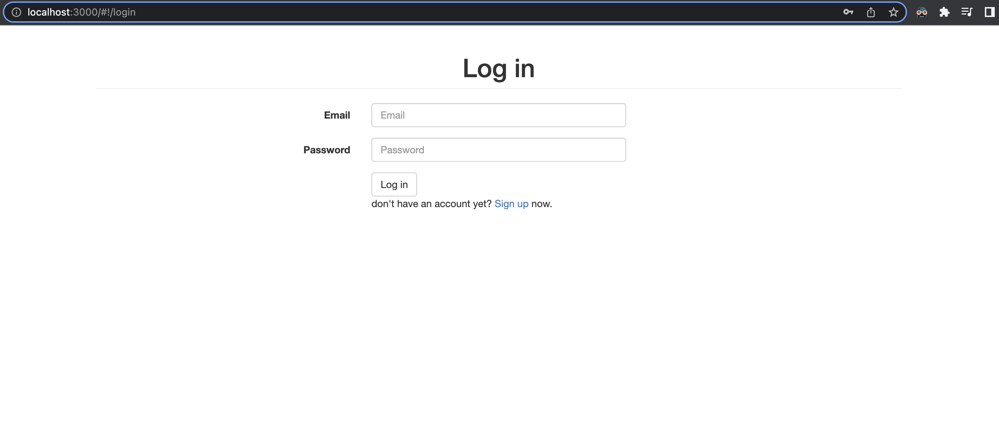
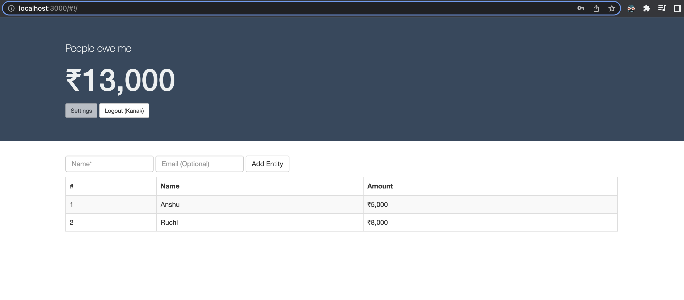
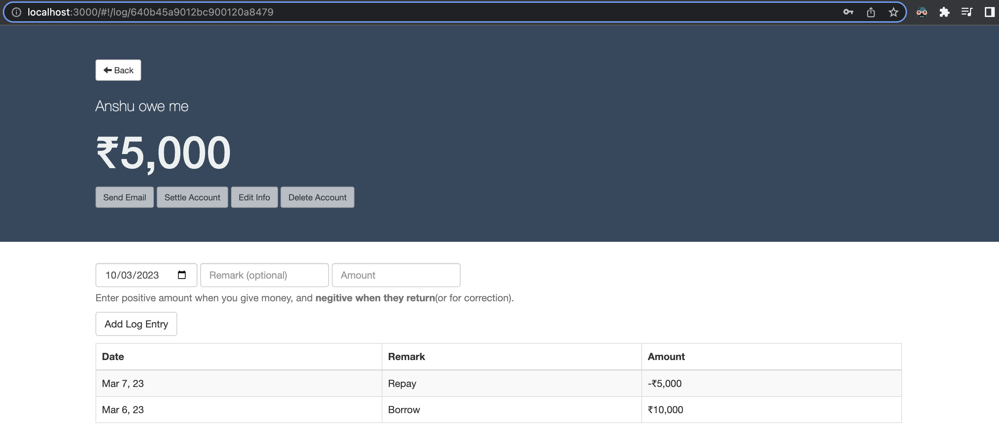

# Who Owe Me

Who Owe Me is a ledger application that helps users keep track of their transactions with other people. With this app, users can add transactions with debit and credit type and the app will display the total outstanding balance for each person as well as the overall outstanding balance.

## Screenshots






## Technologies Used

- Node.js v8
- MongoDB v3.6

## Setup

Before running the application, make sure you have Node.js and MongoDB v3.6 installed on your system. Also, you need to set up the `MONGO_URI` environment variable to connect to the MongoDB database.

### Running with Docker Compose

The easiest way to run the application is to use Docker Compose, which will set up the required components (MongoDB and mongo-express) and build the app.

1. Clone the repository and navigate to the project directory.
2. Create a `.env` file with the following contents:

    ```
    MONGO_PASS=<new-mongo-db-password>
    ```

3. Run the following command to start the application:

    ```
    docker-compose up --build
    ```

4. Access the application at `http://localhost:3000`.

### Running Locally

If you prefer to run the application locally, follow these steps:

1. Clone the repository and navigate to the project directory.
2. Create a `.env` file with the following contents:
    ```
    MONGO_URI=<your-mongodb-uri>
    ```

Replace `<your-mongodb-uri>` with your MongoDB connection string.
3. Install the required dependencies by running the following command:
    ```
    npm install
    ```

4. Start the application by running the following command:
    ```
    npm start
    ```

5. Access the application at `http://localhost:3000`.

## Usage

1. Login to the application using your credentials.
2. Add people with whom you transact by clicking on "Add Person" button and filling the form.
3. Add transactions with debit and credit type for each person by clicking on the "Add Transaction" button and filling the form.
4. The app will show the total outstanding balance for each person and overall outstanding balance.
